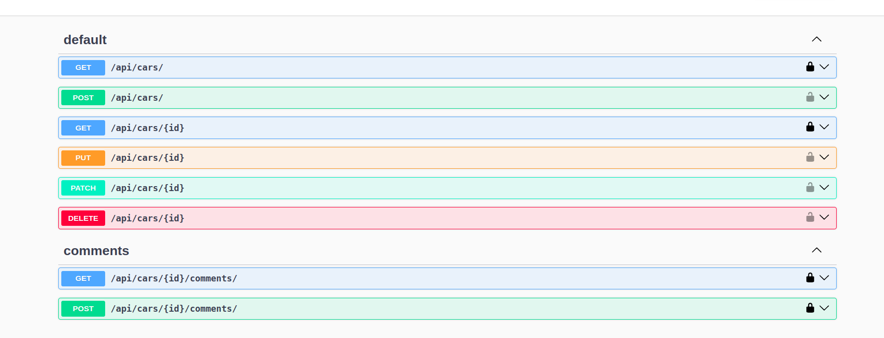
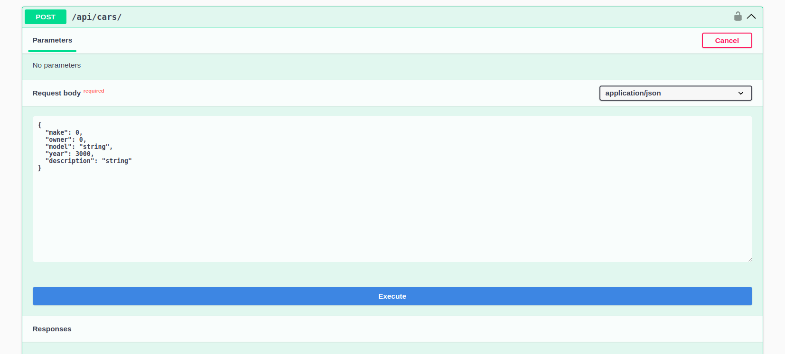

# test_task_03.01.2025
Тестовое задание для компании IT-Solutions

## Краткое Описание

Реализован проект для управления записями об автомобилях в соотвествии с техническим заданием.

Технологии:
* Django
* DRF
* PostgreSQL

Для документирования API использовался пакет drf_spectacular.

## Как запустить проект:

**Важно**

Для билда проекта вам понадобится .env файл в коренвой директории проекта.
Создайте его: ```touch .env``` и поместите в него следующие строки:

```
# DJANGO VARS
DJANGO_SECRET_KEY = "django-insecure-k5pixdje+o&na^9rft7ib@ge%1z^i$a^y0s5+epi7*62#h&^f+"

# DATABASE VARS
POSTGRES_DB = "cars_manager_database"
POSTGRES_USER = "db_admin"
POSTGRES_PASSWORD = "db_admin_pass"
```
(Мне понятно, что в репозиториях ключи и пароли (и дампы бд) оставлять нельзя, в контексте этого задания это оправдано)

Для запуска проект понадобиться Docker.
Приведеные ниже команды актуальны для Unix систем.

1) Забилдите контейнеры командой:

```
    docker compose up (Или docker-compose up)
```

2) Получите id контйнера бэкэнда командой:

```
    docker ps
```
Скопируйте Id контейнера с именем "cars_manager_backend-1".

3) Зайдите в консоль контейнера

```
    docker exec -it ['id контейнера'] bash
```

4) Выполните миграции командой

```
    python3 manage.py migrate --settings=config.local
```

5) Запустите сервер

```
    python3 manage.py runserver 0.0.0.0:8000 --settings=config.local
```

Готово!

## Использование API:

Для того, что бы посмотреть документацию API, запустите сервер разработки и перейдите по адресу:

http://['host']:['port']/api/doc (http://0.0.0.0:8000/api/doc)

drf-specatcular предоставляет интерфейс для тестирования взаимодействия с Api. Там удобно описаны форматы запросов и ответов.

**Если нужна дока, то [API Документация](additional/docs/api.md)**

Страница документации API:



Отправка POST-запроса


